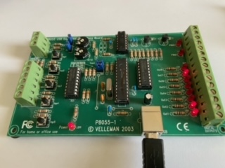

# libk8055
## Introduction
The K8055 library allows access to Velleman's K8055 card and with minor modifications the K8055N card under Linux. This software was developed to replace all other half-complete softwares for the k8055 board under Linux. The library is made from scratch with the same functions as described in Velleman's DLL usermanual. The library was written by Sven Lindberg and the command line tool is developed from Julien Etelain and Edward Nys code.

## Download
The archive containing the sources can be found on the [Linux K8055 Library Website](http://libk8055.sourceforge.net/).

## Modify
A number of files require modification to clear bugs.  The changes are listed below.
### Makefile
The Makefile in its current form will prevent you from installing the library, header file, command line program and man page.  To rectify this open the Makefile in your prefered editor and goto line 7 which reads:

`PREFIX = ?/usr/local`

Edit the line to remove the "?" so that line 7 now reads as:

`PREFIX = /usr/local`

### libk8055.c
The following two changes are required to be made to the library.c file
#### Read K8055N Board
There are now two versions of the K8055 board.  The K8055 library can only read data from the original version.  If you have a K8055N the following change is required.  Open libk8055.c in your prefered editor and goto line 162 which is part of the following function

`static int ReadK8055Data(void)`

Modify the for loop from:

    for(i=0; i < 3; i++)
    {
        read_status = usb_interrupt_read(CurrDev->device_handle, USB_INP_EP, (char *)CurrDev->data_in, PACKET_LEN. USB_TIMEOUT);
        if ((read_status == PACKET_LEN) && (CurrDev->data_in[1] == CurrDev->DevNo )) return 0;
        if (DEBUG)
            fprintf(stderr, "Read retry\n");
    }

to:

    for(i=0; i < 3; i++)
    {
        read_status = usb_interrupt_read(CurrDev->device_handle, USB_INP_EP, (char *)CurrDev->data_in, PACKET_LEN. USB_TIMEOUT);
        if ((read_status == PACKET_LEN) && (CurrDev->data_in[1] == CurrDev->DevNo )) return 0;
        if ((read_status == PACKET_LEN) && (CurrDev->data_in[1] == CurrDev->DevNo + 10 )) return 0;
        if (DEBUG)
            fprintf(stderr, "Read retry\n");
    }

#### Counter Debounce

The function

`int SetCounterDebounceTime(long CounterNo, long DebounceTime)`

on line 568 which set the counter debounce time does not have any check to if the value being sent to the counter is within the valid reange.  If a 0 is sent the counters run away. The notes in the code state that the debounce value sent to the bord must be between 1 and 255 inclusive.  This has been confirmed by reviewing the source code for thWindows DLL. The code between lines 585 and 587 needs to be changed from:

        if (value > ((int)value + 0.49999999))  /* simple round() function) */
            value += 1;
        CurrDev->data_out[5 + CounterNo] = (unsigned char)value;

to:

        if (value > ((int)value + 0.49999999))  /* simple round() function) */
            value += 1;
        if (value < 0) value = 1;
        if (value > 255) value = 255;
        CurrDev->data_out[5 + CounterNo] = (unsigned char)value;

### velleman.rules
There is an issue with the file "velleman.rules" supplied with the library.  This file
allows normal users to access the K8055 board when connected to the computer.  It
should do this by assigning the board's device node to a group specified in the file
which users who need access to the board are members off.  In this case the group is
"k8055".  However due to a error in the file it assigns all the device nodes to the
"k8055" group thus introducing security vulnerabilities to the host computer or even
preventing it operating correctly.

I have replaced the contents of the supplied "velleman.rules" file with the following:

>SUBSYSTEM=="usb*", ATTRS{idVendor}=="10cf", ATTRS{idProduct}=="5500", SYMLINK+="k8055_0", MODE="0660", GROUP="k8055"     
>SUBSYSTEM=="usb*", ATTRS{idVendor}=="10cf", ATTRS{idProduct}=="5501", SYMLINK+="k8055_1", MODE="0660", GROUP="k8055"     
>SUBSYSTEM=="usb*", ATTRS{idVendor}=="10cf", ATTRS{idProduct}=="5502", SYMLINK+="k8055_2", MODE="0660", GROUP="k8055"     
>SUBSYSTEM=="usb*", ATTRS{idVendor}=="10cf", ATTRS{idProduct}=="5503", SYMLINK+="k8055_3", MODE="0660", GROUP="k8055"     

## Compile and Install
Once you have made the changes to the files as described above all that remains is to
install any required prerequisites, compile and install the library and demonstration program as follows:

>make all    
>sudo make install

After insuring a k8055 board is plugged in and is cofigured  for port 0 you can test
the demonstration program and library by running the command:

>sudo k8055 -p:0 -num:20 -delay:500

The sudo command is required at this time as only "root" has access to the board.  To
allow normal users to acces the board you need to following:

>groupadd k8055     
>usermod -a -G k8055 username

This creates the group "k8055" and adds the user "username" to the group.

Next copy the amended "velleman.rules" file to `/etc/udev/rules.d` and reboot the
computer.  This will allow normal users to access the attached k8055 board using
either k8055 or qk8055.

